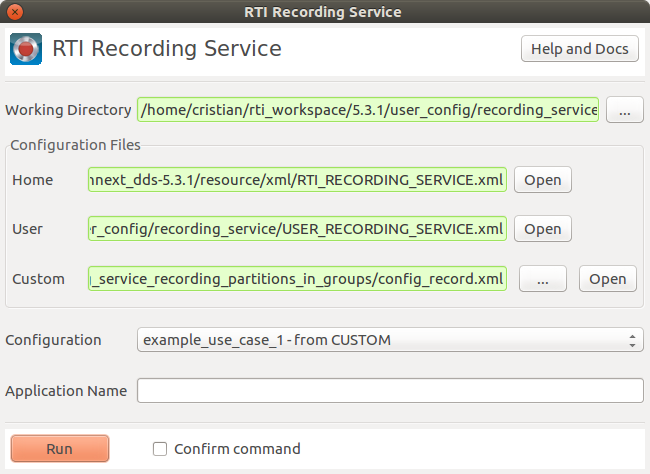
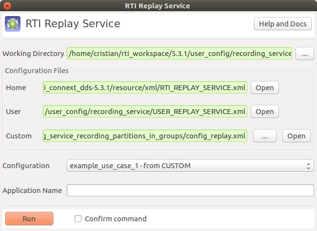

# Recording/Replay Service Configuration Example: Recording partitions in groups

## Concept
This example illustrates the use of Recording/Replay Service in the three
use cases described below. We use RTI Shapes Demo to explain all the use cases.

*Note*: Domain 0 is used in this example. You need to configure RTI Shapes Demo
accordingly.

## Example description
In order to run this example, you will need 2 instances of Shapes Demo. We will
use one of them as a publisher and the other one as a subscriber.

*Note*: to better visualize this example, you can _Hide history_ from Controls
menu. Another option is to set the history to 1 on the subscriber, so you can
pause the publisher and see the results.

### RTI Shapes Demo / Publisher
On the publisher instance, publish the following shapes with default QoS.

Shape   | Color   | Partition
--------|---------|----------
Square  | GREEN   | `{empty}`
Square  | PURPLE  | *
Square  | RED     | A
Circle  | RED     | A
Square  | BLUE    | B
Circle  | BLUE    | B
Circle  | YELLOW  | C

### RTI Shapes Demo / Subscriber
On the subscriber instance, subscribe to the following shapes with default QoS.

Shape   | Partition
--------|----------
Square  | `{empty}`
Circle  | `{empty}`
Square  | A
Circle  | B
Circle  | C


You should see the following shapes on the subscriber:

Shape   | Color
--------|--------
Square  | GREEN
Square  | PURPLE
Square  | RED
Circle  | BLUE
Circle  | YELLOW


### Use Case 1
**RECORD** - Given a specific domain (domainId = 0), record every topic (with
all of their fields) from every partition. For every topic, data from different
partitions will be stored in a single table, so there's no way to distinguish
partitions afterward.

**REPLAY** - Publish all the recorded data (from every topic) to a specific
domain (domainId = 0) using the "asterisk" ( * ) partition. This will match
every partition used by a Subscriber.

#### How to record
Make sure the Shapes Demo publisher instance is running on domain 0 - it
should be publishing data. To start recording, run:

```
rtirecord -cfgFile config_record.xml -cfgName example_use_case_1
```

Data will be recorded in *example_use_case_1.dat_0_0* file. After a few
seconds, stop the recording service with Ctrl+C.


#### How to replay
Before replaying, _Pause Publishing_ in the Shapes Demo publisher. To replay
data, run:

```
rtireplay -cfgFile config_replay.xml -cfgName example_use_case_1
```

The Shapes Demo subscriber will show every shape that was being published by
the publisher instance, regardless of their partition.


### Use Case 2
**RECORD** - Given a specific domain (domainId = 0), record every topic (with all
of their fields) from partitions A and B. For every topic, data from different
partitions will be stored in a separate table, so they can be replayed in
different partitions afterward.

**REPLAY** - Publish all the recorded data (from every topic) to a specific
domain (domainId = 0). Data will be published in the same partition it was
recorded from (either A or B). Note that data matching both partitions when
recording will be published twice.

#### How to record
Make sure the Shapes Demo publisher instance is running on domain 0 - it
should be publishing data. To start recording, run:

```
rtirecord -cfgFile config_record.xml -cfgName example_use_case_2
```

Data will be recorded in *example_use_case_2.dat_0_0* file. After a few
seconds, stop the recording service with Ctrl+C.


#### How to replay
Before replaying, _Pause Publishing_ in the Shapes Demo publisher. To replay
data, run:

```
rtireplay -cfgFile config_replay.xml -cfgName example_use_case_2
```

The Shapes Demo subscriber will only show the blue circle, the purple square,
and the red square. Note that the yellow circle and the green square are not
shown now. The reason is that the yellow circle was published in partition C
and the green square was published in the `{empty}` partition. In this use
case, we didn't configured Recording service to get data from these partitions.


### Use Case 3
**RECORD** - Given a specific domain (domainId = 0), record every topic (with
all of their fields) from every partition. Metadata will be recorded as well,
so RTI Replay can distinguish the partitions afterward.

**REPLAY** - Publish all the recorded data (from every topic) to a specific
domain (domainId = 0). Data will be published in the same partition it was
recorded from. Data will be replayed according to the metadata in the database,
so no duplicate samples will exist.

#### How to record
Make sure the Shapes Demo publisher instance is running on domain 0 - it
should be publishing data. To start recording, run:

```
rtirecord -cfgFile config_record.xml -cfgName example_use_case_3
```

Data will be recorded in *example_use_case_3.dat_0_0* file. After a few
seconds, stop the recording service with Ctrl+C.


#### How to replay
Before replaying, _Pause Publishing_ in the Shapes Demo publisher. To replay
data, run:

```
rtireplay -cfgFile config_replay.xml -cfgName example_use_case_3
```

The Shapes Demo subscriber will show the same shapes that were displayed when
the Demo publisher was running. Data is now being replayed in the same
partitions it was recorded from. This is achieved by recording the metadata and
replaying with the <use_original_partitions> policy.


## Running the example from the RTI Launcher

You may want to use RTI Recording Service's launcher to run this example. In
this case, you will need to specify the configuration file in the "Custom"
area, and select "example_use_case_<x> - from CUSTOM" in the "Configuration"
area.




The same configuration should be specified to RTI Replay Service's launcher.


