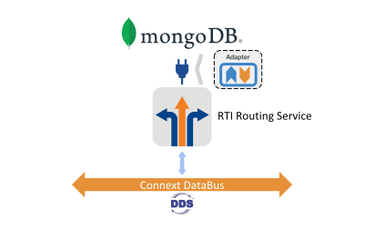
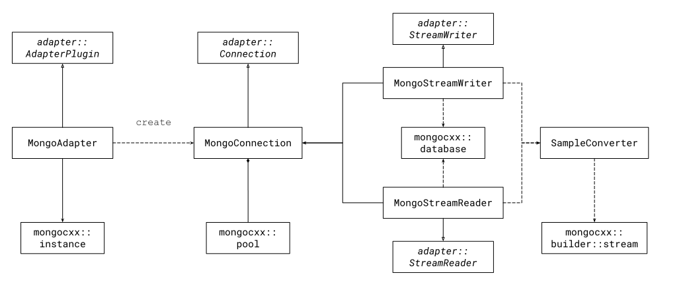

Example Code: MongoDB Adapter
==============================

Concept
-------

This example leverages the `RTI Routing Service Adapter SDK` to integrate DDS with
`MongoDB`. It shows to how to build an adapter the uses the MongoDB C++ Driver to
perform operations in a running instance of a MongoDB database.

This example assumes that you are familiar with both `Routing Service` and `MongoDB`.
You can find the reference documentation for both these products following the links
below:

- `RTI Routing Service User's Manual (version 6.0.1) <https://community.rti.com/static/documentation/connext-dds/6.0.1/doc/manuals/routing_service/index.html>`_
- `Mongo DB Manual (current version) <https://docs.mongodb.com/manual/>`_
- `Mongo DB C++ Driver (v3) <http://mongocxx.org/mongocxx-v3/>`_

Example Description
-------------------

The example provides two main components:

- A `RoutingService` adapter library that links with the ``MongoDB`` C++ driver library
  (``mongocxx``).

- A `RoutingService` configuration that instantiates this example adapter and a DDS
  participant, and establishes an automatic route to integrate usert `Topic` data with
  a ``MongoDB`` database.

You will see how using `RoutingService` you can get data from a DDS domain into a `MongoDB`
database that runs in a cloud-based cluster. The sections below provide details about
the adapter architecture and the mapping between DDS and MongoDB concepts.

DDS Mapping
-----------

The mapping between DDS and MongoDB select in this example consists of the following
items:

- A DDS `domain` maps into a single `Database`, whose name is arbitrary and user provided.
  Domain in this context does not reflect a single domain ID but instead a cohesive
  system domain, which may be comprised of one or more domain IDs.

- A DDS `Topic` maps into a single database `Collection`, whose name is the actual
  name of the `Topic`.

- `Topic` samples map into individual `Document` objects. An object for a sample always
  contains two top-level members: a ``data`` item that contains the user data (whose
  content depends on the actual user-defined type) and an ``info`` item that contains the
  associated metadata (``SampleInfo``).

Adapter Architecture
--------------------

Generally speaking, applications that access `MongoDB` database using the driver API
require performing the following operations:

- Create a client connection to a concrete database running stance.
- Obtain a handle to a database.
- Use the handle to perform operations to the database.

With these operations in mind and considering some of the restrictions integrating the
driver in the application–such as the threading model-, we propose the following model
for the adapter:

- ``AdaterPlugin``: keeps a reference to the ``mongocxx::instance``, which is the
  singleton unit for the driver. It is hence equivalent to the plugin instance, which
  is expected to be loaded only once by a `Routing Service` instance.
- ``Connection``: instantiates a single client pool and identifies a single database. This
  model allows multiple ``StreamWriters`` and ``StreamReaders`` to obtain clients from
  the pool as needed. This is important to support concurrency with multiple threads in a
  session.
- ``StreamWriter``: uses the parent ``Connection`` to obtain a database client handle
  and insert `Document` objects in the write operation. The ``StreamWriter`` uses the
  ``SampleConverter`` helper functions to convert ``DynamicData`` and ``Info`` samples
  to ``MongoDB`` objects.

The source code contains additional documentation with more implementation details.

