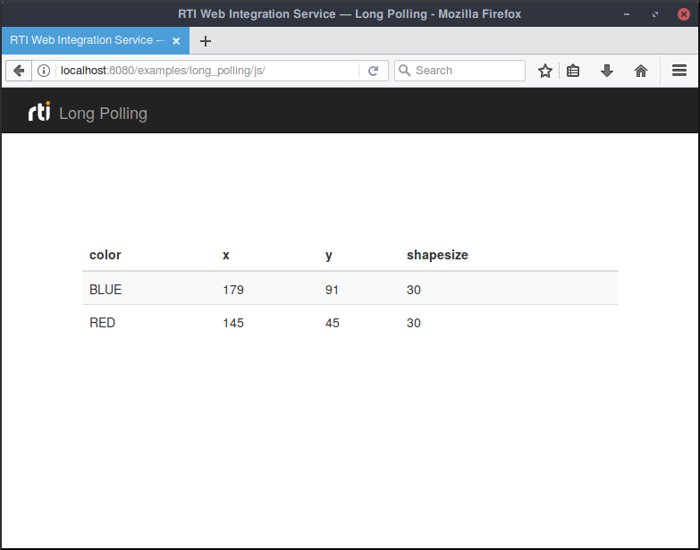

# Long Polling

This example illustrates how to configure Web Integration Service and different
client applications to subscribe to Square Topics using Long Polling.

Long Polling emulates a server push mechanism over HTTP by configuring client
and server applications to perform long-lasting HTTP requests that do not
trigger an immediate response.

In the context of _Web Integration Service_, long polling enables client
applications to register `on_data_available()` functions that only get called
when new data becomes available in the remote DDS _DataReader_. To achieve this
behavior, the _Web Integration Service_ client in this example leverages a set
of query parameters supported by the GET operation that triggers a DDS
`take()` or a `read()` operation on the remote DDS _DataReader_. These
query parameters configure a set of DDS *WaitSets* on the server side that
block the `read()` or `take()` operation until certain conditions are met.
In this specific example, we use two query parameters that control the way
samples are read:

-   `maxWait = 30`, which configures the internal *WaitSet* of _Web Integration
    Service_ to wait for up to 30 seconds for the read conditions to be met. In
    this case, the only read condition is set by the value of `sampleStateMask`.
    If samples become available before `maxWait`, the *WaitSet* wakes up and
    _Web Integration Service_ generates an HTTP response right away containing
    the sequence of read samples. Otherwise, after 30 seconds, _Web Integration
    Service_ times out and generates a response containing an empty sequence of
    samples.
-   `sampleStateMask = NOT_READ`, which configures the *WaitSet* to wait until
    new samples (i.e., samples that have not been read) become available. This
    query parameter can be skipped when performing a `take()` operation.

Instructions on how to run _Web Integration Service_ and the client
applications for each specific language are available under:

- [js/README.md](js/README.md)
- [python/README.md](python/README.md)

