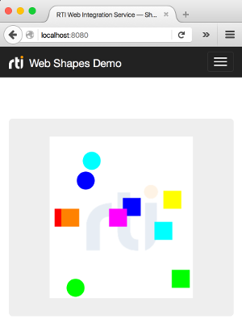

# Web Shapes Demo

This example illustrates how to subscribe to Shape topics using _RTI Web
Integration Service_. The samples read are drawn on a Canvas using Fabric—a
simple JavaScript framework.



## Running the Example

To run this example, execute _Web Integration Service_, _RTI Shapes Demo_, and
the JavaScript client as follows.

### Running Web Integration Service

To run the example, open a terminal and enter the following command:

```shell
$NDDSHOME/bin/rtiwebintegrationservice \
  -cfgFile /path/to/examples/parent/rest/simple_shapes_demo/simple_shapes_demo.xml \
  -cfgName simpleShapesDemo \
  -enableKeepAlive yes \
  -documentRoot /path/to/examples/parent
```

Where:

-   The `-cfgFile` argument loads the appropriate configuration file into _Web
    Integration Service_.
-   The `-cfgName` argument specifies the configuration to be instantiated—in
    this case ``SimpleShapesDemo``—which starts the `SimpleShapesDemoApp`. This
    application instantiates a _DomainParticipant_ with _DataReaders_ to read to
    all shape topics (i.e., Squares, Circles, and Triangles).
-   The `-documentRoot` argument specifies the folder that _Web Integration
    Service's_ web server will provide when accessing the default URL. That is
    `http://<hostname>:8080`. This specific example can then be found under
    `http://<hostname>:8080/rest/simple_shapes_demo/js`.
-   The `-enablekeepAlive` argument configures the service to keep open the
    underlying TCP connection between client and server between subsequent
    requests and responses when possible.

### Running RTI Shapes Demo

Once you have started _Web Integration Service_, you can open _RTI Shapes
Demo_ and start publishing shapes.

### Running Simple Shapes Demo JavaScript Client

Open a browser and navigate to
`http://<hostname>:8080/rest/simple_shapes_demo/js`. You will find there all the
shapes that are being published.
