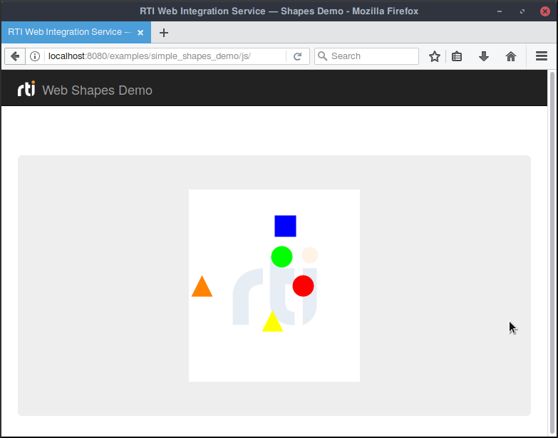

# WebSockets Shapes Demo

This example illustrates how to subscribe to Shape topics using a webSocket
communication _RTI Web Integration Service_ WebSockets API instead of Rest requests.

Instructions on how to run _Web Integration Service_ and the client applications
for each specific language are available under:

- [js/README.md](js/README.md)

